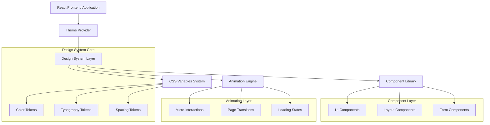

# UI/UX Teknik Mimari Dokümantasyonu

## 1. Mimari Tasarım



## 2. Teknoloji Açıklaması

- **Frontend**: React@18 + TypeScript + Vite
- **Styling**: Tailwind CSS@3 + CSS Custom Properties
- **UI Library**: Radix UI + Custom Components
- **Animation**: CSS Transitions + Framer Motion (optional)
- **Icons**: Lucide React
- **Fonts**: Inter (Google Fonts)
- **Theme**: CSS Variables + Context API

## 3. Dosya Yapısı

```
src/
├── styles/
│   ├── design-system.css          # Ana tasarım sistemi
│   ├── components.css              # Bileşen stilleri
│   ├── animations.css              # Animasyon tanımları
│   ├── utilities.css               # Yardımcı sınıflar
│   └── themes/
│       ├── light.css               # Açık tema
│       └── dark.css                # Koyu tema
├── components/
│   ├── ui/                         # Temel UI bileşenleri
│   │   ├── button.tsx
│   │   ├── card.tsx
│   │   ├── input.tsx
│   │   └── ...
│   ├── layout/                     # Layout bileşenleri
│   │   ├── header.tsx
│   │   ├── sidebar.tsx
│   │   └── footer.tsx
│   └── forms/                      # Form bileşenleri
│       ├── form-field.tsx
│       ├── form-section.tsx
│       └── ...
├── hooks/
│   ├── useTheme.ts                 # Tema yönetimi
│   ├── useAnimation.ts             # Animasyon kontrolü
│   └── useResponsive.ts            # Responsive utilities
└── constants/
    ├── design-tokens.ts            # Tasarım token'ları
    ├── breakpoints.ts              # Responsive breakpoint'ler
    └── animations.ts               # Animasyon sabitleri
```

## 4. CSS Değişken Sistemi

### 4.1 Temel Yapı
```css
:root {
  /* Color Tokens */
  --color-primary-50: 220 100% 97%;
  --color-primary-500: 220 85% 25%;
  --color-primary-900: 220 100% 10%;
  
  /* Typography Tokens */
  --font-size-xs: 0.75rem;
  --font-size-sm: 0.875rem;
  --font-size-base: 1rem;
  
  /* Spacing Tokens */
  --space-1: 0.25rem;
  --space-2: 0.5rem;
  --space-4: 1rem;
  
  /* Animation Tokens */
  --duration-fast: 150ms;
  --duration-normal: 250ms;
  --ease-smooth: cubic-bezier(0.4, 0, 0.2, 1);
}
```

### 4.2 Semantic Tokens
```css
:root {
  /* Semantic Colors */
  --color-text-primary: hsl(var(--color-neutral-900));
  --color-text-secondary: hsl(var(--color-neutral-700));
  --color-bg-primary: hsl(var(--color-neutral-50));
  --color-bg-secondary: hsl(var(--color-neutral-100));
  
  /* Component Tokens */
  --button-height-sm: 2.25rem;
  --button-height-md: 2.5rem;
  --button-height-lg: 2.75rem;
  
  --card-padding: var(--space-6);
  --card-radius: var(--radius-lg);
  --card-shadow: var(--shadow-sm);
}
```

## 5. Bileşen API Tasarımı

### 5.1 Button Component
```typescript
interface ButtonProps {
  variant?: 'primary' | 'secondary' | 'tertiary' | 'destructive' | 'ghost' | 'link'
  size?: 'xs' | 'sm' | 'md' | 'lg' | 'xl'
  loading?: boolean
  disabled?: boolean
  fullWidth?: boolean
  startIcon?: React.ReactNode
  endIcon?: React.ReactNode
  children: React.ReactNode
  onClick?: () => void
}

// Kullanım
<Button 
  variant="primary" 
  size="md" 
  loading={isSubmitting}
  startIcon={<PlusIcon />}
  onClick={handleSubmit}
>
  Yeni Kayıt
</Button>
```

### 5.2 Card Component
```typescript
interface CardProps {
  variant?: 'default' | 'elevated' | 'outlined' | 'interactive'
  padding?: 'none' | 'sm' | 'md' | 'lg'
  radius?: 'none' | 'sm' | 'md' | 'lg' | 'xl'
  shadow?: 'none' | 'sm' | 'md' | 'lg' | 'xl'
  children: React.ReactNode
  onClick?: () => void
}

// Kullanım
<Card 
  variant="interactive" 
  padding="lg" 
  shadow="md"
  onClick={handleCardClick}
>
  <CardHeader>
    <CardTitle>Başlık</CardTitle>
  </CardHeader>
  <CardContent>
    İçerik
  </CardContent>
</Card>
```

### 5.3 Form Components
```typescript
interface FormFieldProps {
  label: string
  description?: string
  error?: string
  required?: boolean
  children: React.ReactNode
}

interface InputProps {
  variant?: 'default' | 'filled' | 'outlined'
  size?: 'sm' | 'md' | 'lg'
  state?: 'default' | 'error' | 'success'
  placeholder?: string
  disabled?: boolean
  startAdornment?: React.ReactNode
  endAdornment?: React.ReactNode
}

// Kullanım
<FormField 
  label="E-posta Adresi" 
  description="Geçerli bir e-posta adresi girin"
  error={errors.email}
  required
>
  <Input 
    variant="outlined"
    size="md"
    state={errors.email ? 'error' : 'default'}
    placeholder="ornek@email.com"
    startAdornment={<MailIcon />}
  />
</FormField>
```

## 6. Responsive Tasarım Sistemi

### 6.1 Breakpoint Tanımları
```typescript
export const breakpoints = {
  xs: '0px',
  sm: '640px',
  md: '768px',
  lg: '1024px',
  xl: '1280px',
  '2xl': '1536px'
} as const

export type Breakpoint = keyof typeof breakpoints
```

### 6.2 Responsive Utilities
```typescript
// useResponsive hook
export function useResponsive() {
  const [breakpoint, setBreakpoint] = useState<Breakpoint>('xs')
  
  useEffect(() => {
    const updateBreakpoint = () => {
      const width = window.innerWidth
      if (width >= 1536) setBreakpoint('2xl')
      else if (width >= 1280) setBreakpoint('xl')
      else if (width >= 1024) setBreakpoint('lg')
      else if (width >= 768) setBreakpoint('md')
      else if (width >= 640) setBreakpoint('sm')
      else setBreakpoint('xs')
    }
    
    updateBreakpoint()
    window.addEventListener('resize', updateBreakpoint)
    return () => window.removeEventListener('resize', updateBreakpoint)
  }, [])
  
  return {
    breakpoint,
    isMobile: breakpoint === 'xs' || breakpoint === 'sm',
    isTablet: breakpoint === 'md',
    isDesktop: breakpoint === 'lg' || breakpoint === 'xl' || breakpoint === '2xl'
  }
}
```

## 7. Animasyon Sistemi

### 7.1 Animasyon Tokens
```typescript
export const animations = {
  duration: {
    instant: '0ms',
    fast: '150ms',
    normal: '250ms',
    slow: '350ms',
    slower: '500ms'
  },
  easing: {
    linear: 'linear',
    smooth: 'cubic-bezier(0.4, 0, 0.2, 1)',
    sharp: 'cubic-bezier(0.4, 0, 0.6, 1)',
    bounce: 'cubic-bezier(0.34, 1.56, 0.64, 1)'
  }
} as const
```

### 7.2 Animasyon Utilities
```css
/* Fade animations */
.animate-fade-in {
  animation: fadeIn var(--duration-normal) var(--ease-smooth);
}

.animate-fade-out {
  animation: fadeOut var(--duration-normal) var(--ease-smooth);
}

/* Slide animations */
.animate-slide-up {
  animation: slideUp var(--duration-normal) var(--ease-smooth);
}

.animate-slide-down {
  animation: slideDown var(--duration-normal) var(--ease-smooth);
}

/* Scale animations */
.animate-scale-in {
  animation: scaleIn var(--duration-fast) var(--ease-bounce);
}

/* Keyframes */
@keyframes fadeIn {
  from { opacity: 0; }
  to { opacity: 1; }
}

@keyframes slideUp {
  from { 
    opacity: 0; 
    transform: translateY(1rem); 
  }
  to { 
    opacity: 1; 
    transform: translateY(0); 
  }
}

@keyframes scaleIn {
  from { 
    opacity: 0; 
    transform: scale(0.95); 
  }
  to { 
    opacity: 1; 
    transform: scale(1); 
  }
}
```

## 8. Tema Sistemi

### 8.1 Theme Provider
```typescript
interface ThemeContextType {
  theme: 'light' | 'dark'
  setTheme: (theme: 'light' | 'dark') => void
  toggleTheme: () => void
}

export function ThemeProvider({ children }: { children: React.ReactNode }) {
  const [theme, setTheme] = useState<'light' | 'dark'>('light')
  
  const toggleTheme = useCallback(() => {
    setTheme(prev => prev === 'light' ? 'dark' : 'light')
  }, [])
  
  useEffect(() => {
    document.documentElement.classList.toggle('dark', theme === 'dark')
  }, [theme])
  
  return (
    <ThemeContext.Provider value={{ theme, setTheme, toggleTheme }}>
      {children}
    </ThemeContext.Provider>
  )
}
```

### 8.2 Theme Utilities
```typescript
export function useTheme() {
  const context = useContext(ThemeContext)
  if (!context) {
    throw new Error('useTheme must be used within ThemeProvider')
  }
  return context
}

export function useThemeAwareValue<T>(lightValue: T, darkValue: T): T {
  const { theme } = useTheme()
  return theme === 'dark' ? darkValue : lightValue
}
```

## 9. Performans Optimizasyonları

### 9.1 CSS Optimizasyonları
```css
/* GPU acceleration for smooth animations */
.gpu-accelerated {
  transform: translateZ(0);
  will-change: transform;
}

/* Efficient transitions */
.transition-transform {
  transition-property: transform;
  transition-timing-function: var(--ease-smooth);
  transition-duration: var(--duration-fast);
}

/* Contain layout shifts */
.contain-layout {
  contain: layout style;
}

/* Optimize repaints */
.optimize-repaint {
  backface-visibility: hidden;
  perspective: 1000px;
}
```

### 9.2 Component Optimizasyonları
```typescript
// Memoized theme-aware component
export const ThemedComponent = memo(function ThemedComponent({
  children,
  ...props
}: ComponentProps) {
  const { theme } = useTheme()
  
  return (
    <div 
      className={cn(
        'themed-component',
        theme === 'dark' && 'dark-variant'
      )}
      {...props}
    >
      {children}
    </div>
  )
})

// Lazy loaded heavy components
const HeavyChart = lazy(() => import('./HeavyChart'))

export function ChartContainer() {
  return (
    <Suspense fallback={<ChartSkeleton />}>
      <HeavyChart />
    </Suspense>
  )
}
```

## 10. Test Stratejisi

### 10.1 Visual Regression Tests
```typescript
// Storybook stories for visual testing
export default {
  title: 'Components/Button',
  component: Button,
  parameters: {
    chromatic: { 
      viewports: [320, 768, 1200] // Test multiple viewports
    }
  }
}

export const AllVariants = () => (
  <div className="space-y-4">
    <Button variant="primary">Primary</Button>
    <Button variant="secondary">Secondary</Button>
    <Button variant="destructive">Destructive</Button>
  </div>
)

export const DarkTheme = AllVariants.bind({})
DarkTheme.parameters = {
  backgrounds: { default: 'dark' },
  theme: 'dark'
}
```

### 10.2 Accessibility Tests
```typescript
// Jest + Testing Library tests
import { render, screen } from '@testing-library/react'
import { axe, toHaveNoViolations } from 'jest-axe'

expect.extend(toHaveNoViolations)

test('Button should be accessible', async () => {
  const { container } = render(
    <Button variant="primary">Click me</Button>
  )
  
  // Check for accessibility violations
  const results = await axe(container)
  expect(results).toHaveNoViolations()
  
  // Check for proper ARIA attributes
  const button = screen.getByRole('button')
  expect(button).toBeInTheDocument()
  expect(button).toHaveAttribute('type', 'button')
})
```

## 11. Deployment ve Monitoring

### 11.1 Build Optimizasyonları
```typescript
// vite.config.ts
export default defineConfig({
  css: {
    postcss: {
      plugins: [
        autoprefixer(),
        cssnano({
          preset: ['default', {
            discardComments: { removeAll: true },
            normalizeWhitespace: true
          }]
        })
      ]
    }
  },
  build: {
    cssCodeSplit: true,
    rollupOptions: {
      output: {
        manualChunks: {
          'design-system': ['./src/styles/design-system.css']
        }
      }
    }
  }
})
```

### 11.2 Performance Monitoring
```typescript
// Performance metrics collection
export function measurePerformance() {
  // Core Web Vitals
  getCLS(console.log)
  getFID(console.log)
  getFCP(console.log)
  getLCP(console.log)
  getTTFB(console.log)
  
  // Custom metrics
  performance.mark('design-system-loaded')
  performance.measure('design-system-load-time', 'navigationStart', 'design-system-loaded')
}
```

Bu teknik mimari, UI/UX geliştirme planının başarılı bir şekilde uygulanması için gerekli tüm teknik detayları ve implementasyon stratejilerini içermektedir.