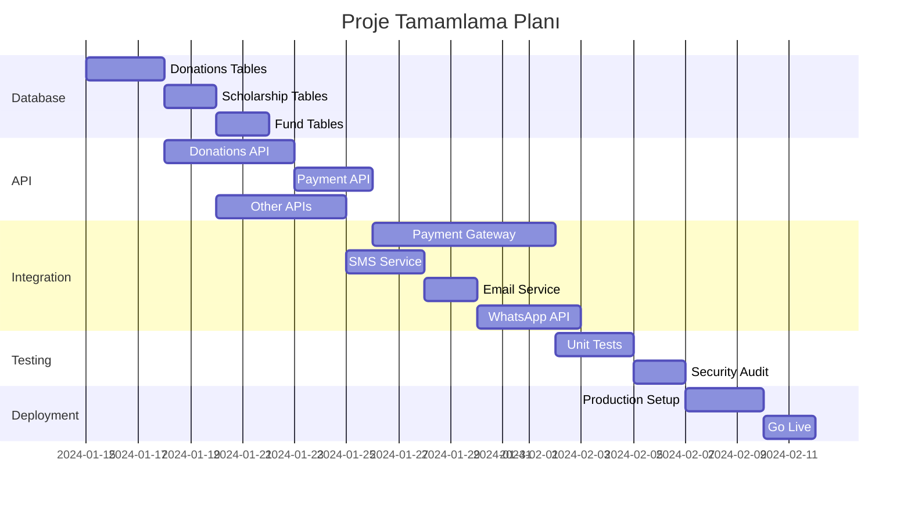

# 📋 KAFKAS PANEL - PROJE ANALİZ RAPORU

**Tarih:** ${new Date().toLocaleDateString('tr-TR')}  
**Proje:** Dernek/NGO Yönetim Sistemi  
**Teknoloji:** React + TypeScript + Express.js + Supabase

---

## 📑 İÇİNDEKİLER

1. [Genel Bakış](#genel-bakış)
2. [Mevcut Durum Analizi](#mevcut-durum-analizi)
3. [Modül Detayları](#modül-detayları)
4. [Teknik Eksikler](#teknik-eksikler)
5. [Kritik Aksiyonlar](#kritik-aksiyonlar)
6. [Zaman Planı](#zaman-planı)
7. [Öneriler](#öneriler)

---

## 🔍 GENEL BAKIŞ

### Proje Hakkında
- **Amaç:** Dernek ve STK'lar için kapsamlı yönetim sistemi
- **Frontend:** React 18, TypeScript, Vite, Tailwind CSS
- **Backend:** Express.js, Supabase (PostgreSQL)
- **State Management:** Zustand, React Query
- **Authentication:** Supabase Auth
- **Deployment:** Vercel ready

### Proje Durumu
- **Tamamlanma:** ~%65
- **Kritik Eksikler:** Database tabloları, Payment sistemi, API endpoint'ler
- **Production Ready:** ❌ Hayır

---

## ✅ MEVCUT DURUM ANALİZİ

### TAMAMLANMIŞ MODÜLLER

#### 1. **Aid (Yardım) Modülü** ✅
```
✓ Database Tabloları
  - beneficiaries
  - applications  
  - aid_records
  - family_members
  
✓ API Endpoints
  - GET/POST/PUT/DELETE /api/beneficiaries
  
✓ Frontend Sayfaları
  - Beneficiaries.tsx
  - Applications.tsx
  - BankOrders.tsx
  - CashOperations.tsx
  - ServiceTracking.tsx
  - HospitalReferrals.tsx
```

#### 2. **Meetings (Toplantılar) Modülü** ✅
```
✓ Database Tabloları
  - meetings
  - meeting_attendees
  - meeting_agenda
  - meeting_minutes
  - meeting_action_items
  
✓ API Endpoints
  - /api/meetings (CRUD operations)
  
✓ Özellikler
  - Toplantı planlama
  - Katılımcı yönetimi
  - Gündem oluşturma
  - Toplantı notları
```

#### 3. **Tasks (Görevler) Modülü** ✅
```
✓ Database Tabloları
  - tasks
  - task_comments
  - task_attachments
  - task_notifications
  
✓ API Endpoints
  - /api/tasks (CRUD operations)
  
✓ Özellikler
  - Görev atama
  - Progress tracking
  - Dosya ekleme
  - Bildirim sistemi
```

#### 4. **Internal Messages (İç Mesajlar) Modülü** ✅
```
✓ Database Tabloları
  - conversations
  - internal_messages
  - conversation_participants
  - message_reactions
  
✓ API Endpoints
  - /api/conversations
  - /api/messages
  
✓ Özellikler
  - Real-time chat
  - Grup sohbetleri
  - Dosya paylaşımı
  - Emoji reactions
```

#### 5. **System (Sistem) Modülü** ✅
```
✓ User Management
  - 6 farklı rol (super_admin, admin, manager, coordinator, volunteer, user)
  - Role-based access control
  
✓ Security Features
  - Supabase Auth entegrasyonu
  - Row Level Security (RLS)
  - IP blocking
  
✓ Performance Monitoring
  - Web Vitals tracking
  - API performance metrics
  - Error logging
```

---

### ⚠️ EKSİK VEYA TAMAMLANMAMIŞ MODÜLLER

#### 1. **Donations (Bağışlar) Modülü** 🔴 KRİTİK
```
❌ Database Tabloları YOK
  - donations tablosu eksik
  - donors tablosu eksik
  - payment_transactions tablosu eksik
  
❌ API Endpoints YOK
  - /api/donations endpoint'i yok
  - /api/donors endpoint'i yok
  
❌ Payment Gateway Entegrasyonu YOK
  - Kredi kartı işlemleri çalışmıyor
  - Online bağış sistemi aktif değil
  
✓ Frontend Sayfaları VAR (ama backend bağlantısı yok)
  - CashDonations.tsx
  - BankDonations.tsx
  - CreditCardDonations.tsx
  - OnlineDonations.tsx
```

#### 2. **Scholarship (Burs) Modülü** 🟡
```
❌ Database Tabloları YOK
❌ API Endpoints YOK
✓ Sadece 2 Frontend Sayfası VAR
  - OrphansStudents.tsx
  - Reports.tsx
```

#### 3. **Fund (Fon) Modülü** 🟡
```
❌ Database Entegrasyonu EKSİK
❌ API Endpoints YOK
✓ Frontend Sayfaları VAR
  - FundMovements.tsx
  - CompleteReport.tsx
  - SourcesExpenses.tsx
```

#### 4. **Messages (Dış Mesajlaşma) Modülü** 🟡
```
⚠️ WhatsApp Entegrasyonu (Mock Service)
  - whatsapp-web.js kullanıyor (production için uygun değil)
  - Official WhatsApp Business API gerekli
  
❌ SMS Gateway Entegrasyonu YOK
❌ Email Service Entegrasyonu YOK
❌ Bulk Messaging Sistemi TAMAMLANMAMIŞ
```

---

## 🛠️ TEKNİK EKSİKLER

### 1. **Database & Migrations** 🔴
```
Sorunlar:
- Migration dosyaları düzensiz (24 adet karışık migration)
- Birçok modül için tablo tanımları eksik
- Foreign key ilişkileri eksik
- Seed data yetersiz

Çözüm:
- Tüm migration'ları temizleyip yeniden organize et
- Eksik tabloları oluştur
- Proper indexing ekle
```

### 2. **API Coverage** 🔴
```
Mevcut: 7 route
- auth, beneficiaries, errors, health, meetings, messages, tasks

Eksik: 8+ route
- donations, donors, scholarship, fund, reports, 
- payments, sms, email, whatsapp
```

### 3. **Testing** 🟡
```
✓ Test setup var (Vitest)
✓ Bazı unit testler var
❌ Coverage düşük (~%30)
❌ Integration test yok
❌ E2E test coverage eksik
```

### 4. **Security** 🟡
```
✓ Authentication (Supabase Auth)
✓ RLS policies tanımlı
✓ CSRF protection hook var
❌ Rate limiting eksik
❌ Input validation bazı yerlerde yok
❌ XSS protection tam değil
```

### 5. **Performance** 🟢
```
✓ Code splitting
✓ Lazy loading
✓ React Query caching
✓ Bundle optimization
✓ PWA support
✓ Performance monitoring
```

---

## 📋 KRİTİK AKSİYONLAR

### PHASE 1: Database & API (2-3 Hafta)

#### 1.1 Donations Modülü Database
```sql
-- Öncelik: YÜKSEK
CREATE TABLE public.donations (
    id UUID PRIMARY KEY DEFAULT uuid_generate_v4(),
    donor_id UUID REFERENCES public.donors(id),
    amount DECIMAL(10,2) NOT NULL,
    currency TEXT DEFAULT 'TRY',
    donation_type TEXT NOT NULL,
    payment_method TEXT NOT NULL,
    payment_status TEXT DEFAULT 'pending',
    transaction_id TEXT,
    receipt_number TEXT,
    notes TEXT,
    created_at TIMESTAMPTZ DEFAULT NOW()
);

CREATE TABLE public.donors (
    id UUID PRIMARY KEY DEFAULT uuid_generate_v4(),
    full_name TEXT NOT NULL,
    identity_number TEXT,
    phone TEXT,
    email TEXT,
    address TEXT,
    is_recurring BOOLEAN DEFAULT false,
    total_donated DECIMAL(10,2) DEFAULT 0,
    created_at TIMESTAMPTZ DEFAULT NOW()
);

CREATE TABLE public.payment_transactions (
    id UUID PRIMARY KEY DEFAULT uuid_generate_v4(),
    donation_id UUID REFERENCES public.donations(id),
    gateway TEXT NOT NULL,
    transaction_data JSONB,
    status TEXT NOT NULL,
    created_at TIMESTAMPTZ DEFAULT NOW()
);
```

#### 1.2 API Endpoints Geliştirme
```typescript
// api/routes/donations.ts
router.get('/donations', getDonations)
router.post('/donations', createDonation)
router.get('/donations/:id', getDonationById)
router.put('/donations/:id', updateDonation)

// api/routes/payments.ts
router.post('/payments/process', processPayment)
router.post('/payments/webhook', handlePaymentWebhook)
router.get('/payments/status/:id', getPaymentStatus)
```

### PHASE 2: Payment Integration (1-2 Hafta)

#### 2.1 Payment Gateway Seçimi
```
Türkiye için:
- İyzico (Önerilen)
- PayTR
- Param

Global:
- Stripe
- PayPal
```

#### 2.2 Integration Checklist
```
□ Test/Production API keys
□ Webhook endpoints
□ 3D Secure implementation
□ Recurring payment support
□ Refund mechanism
□ Receipt generation
```

### PHASE 3: Messaging Services (2 Hafta)

#### 3.1 SMS Integration
```typescript
// Twilio veya NetGSM
interface SMSService {
  sendSMS(to: string, message: string): Promise<boolean>
  sendBulkSMS(recipients: string[], message: string): Promise<void>
  getDeliveryStatus(messageId: string): Promise<SMSStatus>
}
```

#### 3.2 Email Service
```typescript
// SendGrid veya AWS SES
interface EmailService {
  sendEmail(to: string, subject: string, body: string): Promise<boolean>
  sendBulkEmail(recipients: EmailRecipient[], template: string): Promise<void>
  sendTemplateEmail(to: string, templateId: string, data: any): Promise<boolean>
}
```

#### 3.3 WhatsApp Business API
```
□ Facebook Business Manager account
□ WhatsApp Business API access
□ Webhook configuration
□ Message templates approval
□ Rate limiting implementation
```

### PHASE 4: Testing & Security (1 Hafta)

#### 4.1 Test Coverage Goals
```
□ Unit tests: %80+
□ Integration tests: All API endpoints
□ E2E tests: Critical user flows
□ Performance tests: Load testing
```

#### 4.2 Security Checklist
```
□ OWASP Top 10 audit
□ Penetration testing
□ SQL injection prevention
□ XSS protection
□ Rate limiting all endpoints
□ API key rotation
□ SSL/TLS configuration
```

### PHASE 5: Deployment (1 Hafta)

#### 5.1 Infrastructure Setup
```
□ Production database (Supabase)
□ CDN configuration
□ Backup strategy
□ Monitoring (Sentry + Custom)
□ CI/CD pipeline
□ Environment management
```

#### 5.2 Launch Checklist
```
□ Production environment variables
□ Database migrations run
□ SSL certificates
□ Domain configuration
□ Email/SMS credits
□ Payment gateway production mode
□ Monitoring alerts
□ Backup verified
```

---

## 📅 ZAMAN PLANI

### Toplam Süre: 7-9 Hafta



---

## 💡 ÖNERİLER VE BEST PRACTICES

### 1. **Öncelik Sıralaması**
```
1. Donations modülü database ve API (ZORUNLU)
2. Payment gateway entegrasyonu (ZORUNLU)
3. Basic email service (ZORUNLU)
4. SMS service (ÖNEMLİ)
5. WhatsApp integration (OPSİYONEL)
```

### 2. **Development Yaklaşımı**
```
- Test Driven Development (TDD)
- API-first approach
- Continuous Integration
- Code reviews zorunlu
- Documentation güncel tutulmalı
```

### 3. **Security Recommendations**
```
- Tüm sensitive data encrypted
- API rate limiting
- Input validation her endpoint'te
- Regular security audits
- Compliance with KVKK/GDPR
```

### 4. **Performance Targets**
```
- Page Load: < 3s
- API Response: < 200ms
- Uptime: %99.9
- Database queries: < 50ms
```

### 5. **Monitoring & Maintenance**
```
- Error tracking: Sentry
- Performance: Custom dashboard
- Uptime: UptimeRobot
- Logs: Centralized logging
- Backups: Daily automated
```

---

## 📞 DESTEK VE İLETİŞİM

### Teknik Sorular İçin
- GitHub Issues kullanın
- Slack/Discord kanalı oluşturun
- Weekly standup meetings

### Dokümantasyon
- API documentation (Swagger/OpenAPI)
- User manual
- Admin guide
- Developer onboarding guide

---

**Not:** Bu rapor ${new Date().toLocaleDateString('tr-TR')} tarihinde hazırlanmıştır. Proje ilerledikçe güncellenmesi gerekmektedir.
